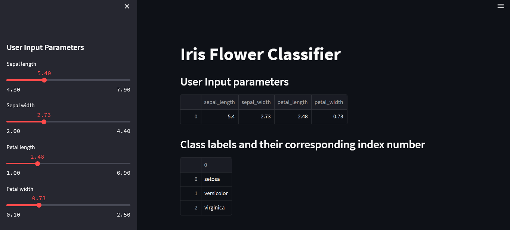

# Iris Classifier


This repository contains code for a web application built with streamlit and scikit-learn that predicts the type of an Iris flower based on its sepal length, sepal width, petal length, and petal width. The app allows users to input values for these parameters using sliders and displays the predicted flower type and the probability of the prediction.

## Installation
Open command prompt and create new environment
```
conda create -n your_env_name python = (any_version_number > 3.10)
```
Then Activate the newly created environment
```
conda activate your_env_name
```
Clone the repository using `git`
```
git clone https://github.com/Prakashdeveloper03/Iris-Classifier.git
```
Change to the cloned directory
```
cd <directory_name>
```
Then install all requirement packages for the app
```
pip install -r requirements.txt
```
Then, Run the `app.py` script
```
streamlit run app.py
```
## 📷 Screenshots
